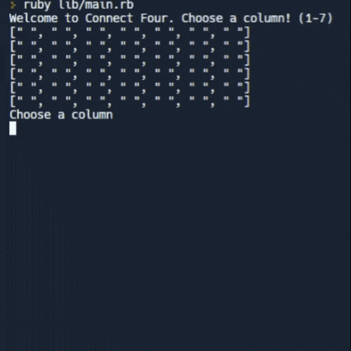

# Connect Four
This is a version of Connect Four that can be played in the terminal.
**From The Odin Project:**
>Hopefully everyone has played Connect Four at some point (if not, see the Wikipedia page). It’s a basic game where each player takes turns dropping pieces into the cage. Players win if they manage to get 4 of their pieces consecutively in a row, column, or along a diagonal.
The game rules are fairly straightforward and you’ll be building it on the command line like you did with the other games.

## How to Run
Visit the [replit](https://replit.com/@krikcet/connectfour-1#lib/main.rb).

## How It's Made:
**Tech Used:** Ruby, Rspec

## Lessons Learned:
I used this lesson to further my abilities with testing and test driven development.